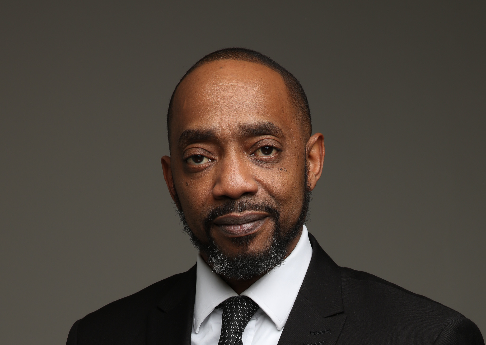

# David Mobolaji Abiodun 

## Work Experience
### Enterprise Technology Manager @ MillTechFX, 
Previously IT Manager Bank of Singapore Wealth Management Europe SA.

Infrastructure Analyst JA Kemp Patent and Trade Mark Attorneys

Network & Desktop Analyst Covington & Burling LLP

## Certification
- ITIL
- Azure
- Microsoft
### University of Essex
MSc Enterprise IT Management

## Research Subjects (First Module)
- An Introduction to Enterprise IT
- Enterprise IT vs. Shadow IT
- Enterprise IT and Automation
- A Comparative Study: Practical Automation Exercises using C and Python
- Business Systems, Outsourcing and the Cloud
- A Cost Comparison Between On-premise, Private and Public Cloud Hosting
- Software Licensing: Commercial vs. Open Source
- A Case Study: Investigating Business and Technical Innovations of Large Corporations and SMEs
- Communications and Digital Transformation
- The Digital Transformation Process
- Future Trends

## Projects
  -  "The adoption of Enterprise IT is the single most significant change that can happen to any company/SME".
  -  You are required to create a sort algorithm in Python that you can use to sort a provided set of integers. For this, you are provided with a simple Python program that implements a basic sort algorithm. You must modify this program, replacing the provided algorithm with another of your choice.
  - You are tasked with developing a PowerPoint presentation (of up to 10 slides) that reflects on future technology/techniques and learning styles. In addition to your PowerPoint, you should also create a recording of your individual reflection (20 minutes in length) with a transcript.
### DMA-1970/Portfolio
This is my GitHub portfolio.

